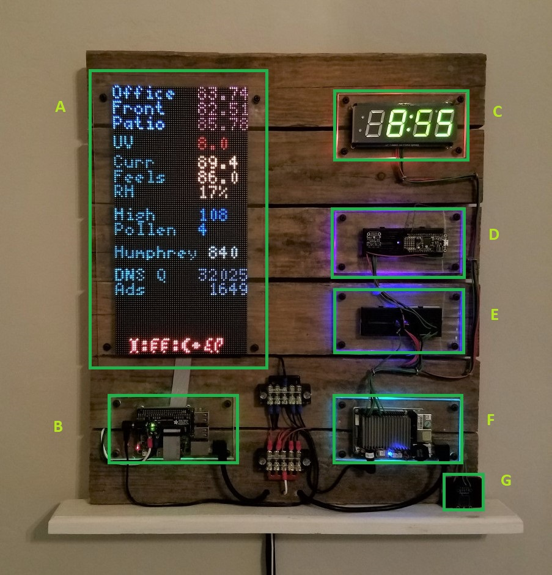

# Slightly over engineered clock

What started out as a a simple 7 segment led clock driven by a Raspberry Pi, over time has turned into:

* A.  2x 64x64 led matrix panels
* A.  2x 64x64 led matrix panel
    * The first three lines are temperatures from different areas around the house.
    * Text color defined by last 20 minutes of temperature changes:
        *  Red - warming up
        *  Blue - unchanged
        *  Green - cooling down
    * Current UV rating outside
    * Current Temperature
    * Currently Feels like
    * RH - Relative Hummidity
    * High for the day
    * Pollen Count
    * Number of lap Humphrey (son's hamster) ran last night
    * DNS Queries over the last 24 hours as recorded by Pi-Hole
    * Number of Ads blocked over the 24 hours as recorded by Pi-Hole
    * Current time in my best attempt at a Klingon font
* B.  Raspberry Pi with Adafruit 64x64 maxitrix bonnet
* B.  Raspberry pi with Adafruit 64x64 maxitrix bonnet
    * Sole purpose is to pull rest-api data and send to the display
    * Code / Section here: https://github.com/mattgoff/wall_board/tree/master/wall_panel
* C.  7 Segment LED with i2c backpack
* D.  I2C Temperautre sensor (left) / M0 Express running circuit python (right)
    * Temperature data pulled by UpBoard
    * M0 Exress running Circuit Python - https://github.com/mattgoff/wall_board/tree/master/m0express
* E.  I2C bus and proto board
* F.  Upboard
    * Responsible for pulling data from different locations and sending to a centralized rest-api
    * https://github.com/mattgoff/wall_board/tree/master/upboard
* G.  Capacitive touch sensor
    * 64x64 matrix is only lit from 6am to 8pm
    * Allows for display outside of normal hours
 

