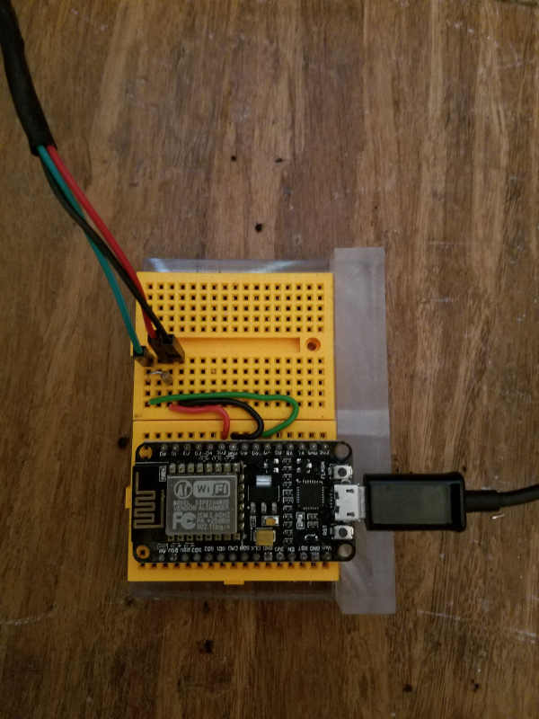
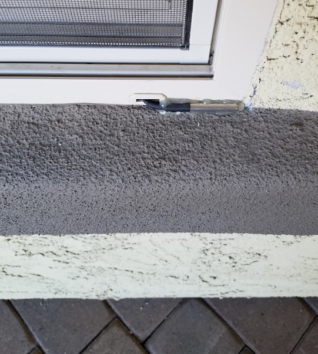

# Temperature Probes

There are two outside temperature probes (one on the South side and one on the North).

Both are esp8266 boards running MicroPython connected to a DS18B20 temperature sensor.

Both sensors upload the current temperature to a rest-api endpoint.

 

