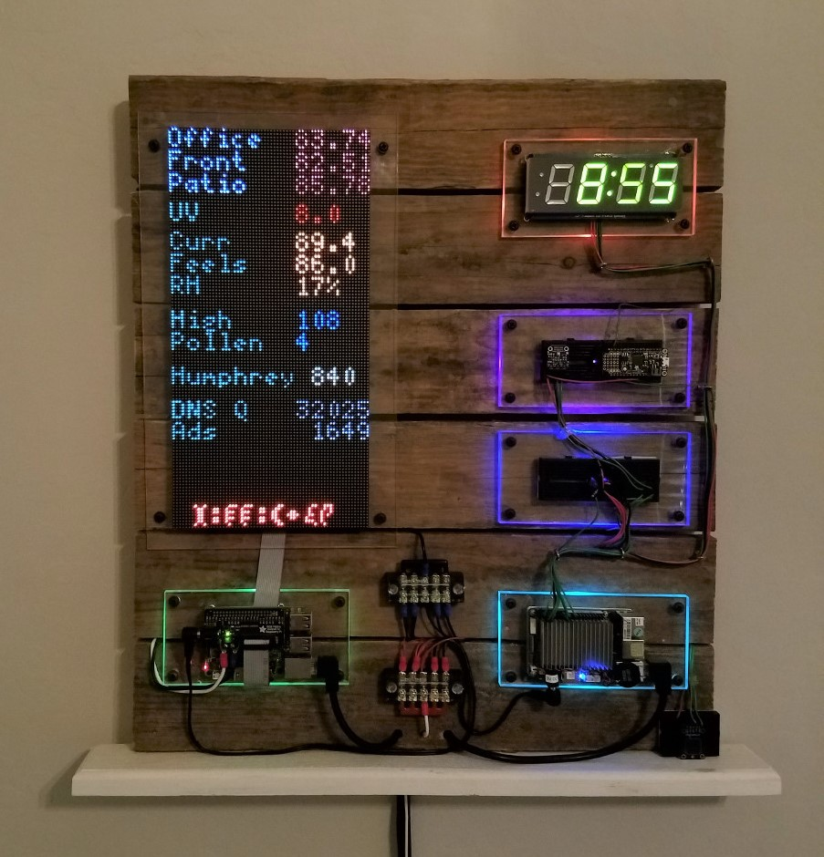

# 64 x 64 Matrix Panel(s)

Base modules driving the 64 x 64 panels was written by:
hzellar - https://github.com/hzeller/rpi-rgb-led-matrix

Adafruit 64 x 64 bonet:
https://www.adafruit.com/product/3211

Documentation / Installation instructions:
https://learn.adafruit.com/adafruit-rgb-matrix-bonnet-for-raspberry-pi/

Main application is panel_prod_v2.py
